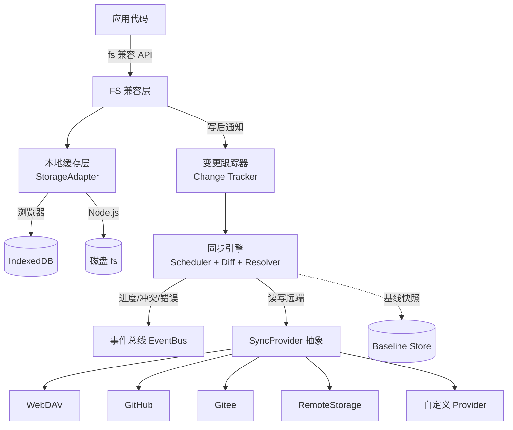
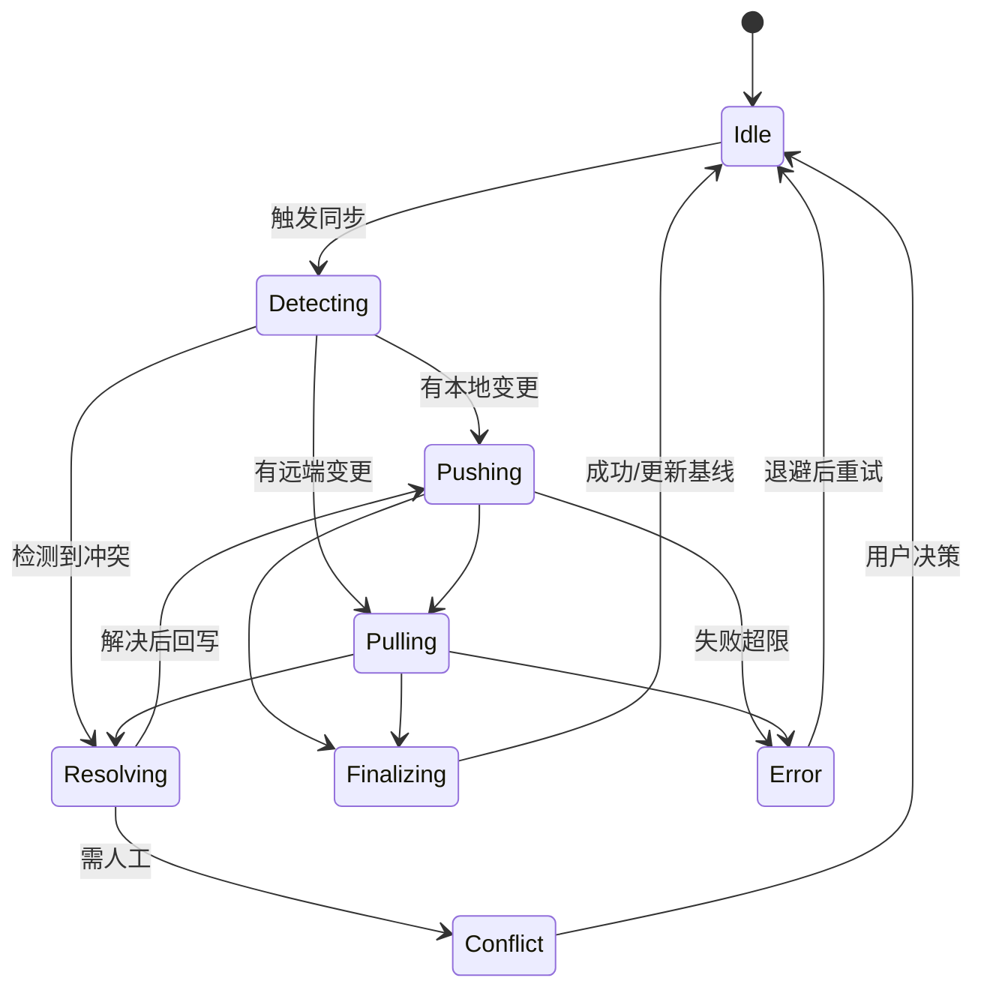

# fs-sync 架构说明

> 文档版本：v0.1（草案）　|　最后更新：2026-07-09

## 1. 设计原则

1. **核心与环境无关**：同步逻辑、冲突算法、调度不依赖浏览器或 Node 特有 API。
2. **分层 + 适配器**：通过 `StorageAdapter` 与 `SyncProvider` 两个抽象隔离底层差异。
3. **本地优先（Local-first）**：所有读写先落本地缓存，保证离线可用与低延迟。
4. **最终一致**：接受网络延迟，保证多端最终一致，而非强一致。
5. **可观测、可恢复**：状态机驱动、事件外发、失败可重试、断点可续传。

## 2. 分层架构

### 2.1 FS 兼容层（FS Layer）

- 对外暴露近似 Node `fs` 的 API（`readFile`、`writeFile`、`mkdir`、`readdir`、`stat`、`rename`、`unlink`、`rm`…）。
- 内部将调用转化为对 `本地缓存层` 的读写。
- 写操作完成后，向**变更跟踪器**登记（产生变更事件），用于触发/标记待同步项。
- 负责路径归一化（统一 POSIX 路径）、错误码映射、编码处理。

### 2.2 本地缓存层（Local Cache Layer）

- 抽象为 `StorageAdapter` 接口，统一两类实现：
  - `IndexedDBAdapter`（浏览器）
  - `NodeFsAdapter`（Node.js）
- 维护：
  - **目录树**：目录与文件的层级关系；
  - **文件内容**：完整二进制/文本；
  - **元数据表**：`path → { mtime, size, contentHash, version, deleted? }`。
- 与同步引擎共享元数据，避免重复计算 hash。

### 2.3 变更跟踪器（Change Tracker）

- 记录自上次成功同步以来本地发生的变更（增/删/改）。
- 作为 pull/push 的差异输入之一。
- 可基于写时打标（write-time mark）或读元数据比对基线两种方式实现（见设计文档）。

### 2.4 同步引擎（Sync Engine）

- 协调差异检测、双向同步、冲突解决、重试与续传。
- 由**调度器（Scheduler）**驱动：手动 / 定时 / 文件变更触发。
- 维护**同步状态机**（见 §4）。
- 依赖 `StorageAdapter`（本地）、`SyncProvider`（远端）、`ConflictResolver`（策略）、`BaselineStore`（基线）。

### 2.5 Provider 抽象层（SyncProvider）

- 远端目标的统一接口，详见接口文档 `api.md`。
- 内置适配器：WebDAV / GitHub / Gitee / RemoteStorage；第三方可扩展。

### 2.6 事件总线（EventBus）

- 解耦引擎与 UI：`progress`、`conflict`、`error`、`synced`、`statechange`。
- 同步过程不阻塞主流程，UI 通过订阅事件刷新状态。

## 3. 运行环境适配

| 关注点 | 浏览器 | Node.js |
| --- | --- | --- |
| 本地缓存 | IndexedDB（异步事务） | 磁盘文件（同步/异步 `fs`） |
| 二进制类型 | `Blob` / `ArrayBuffer` | `Buffer` |
| 路径根 | 虚拟根 `/`（库内命名空间） | 可选映射为真实目录 |
| 定时器 | `setInterval` / `requestIdleCallback` | `setInterval` |
| 网络 | `fetch` / `XMLHttpRequest` | `fetch` / `https` |
| 模块格式 | ESM | ESM + CJS |

> 适配策略：所有环境相关能力收敛到 `StorageAdapter` 与少量平台工具（如 `getTimer`、`getFetch`），核心代码仅依赖抽象。

## 4. 同步状态机

| 状态 | 含义 |
| --- | --- |
| `Idle` | 空闲，等待触发 |
| `Detecting` | 比对本地与远端元数据，构建差异集 |
| `Pushing` | 将本地变更上传到远端 |
| `Pulling` | 将远端变更下载到本地 |
| `Resolving` | 对冲突项应用 `ConflictResolver` |
| `Conflict` | 等待人工决策（Manual 策略） |
| `Finalizing` | 提交基线快照、清理临时态 |
| `Error` | 超过重试上限，进入退避/告警 |

## 5. 数据流（一次双向同步）

1. 触发：定时 / 文件变更 / 手动 `sync()`。
2. 引擎读取本地元数据与基线，向远端 `list()` 拉取远端元数据。
3. 差异检测：
   - 本地有、远端无 → push（新增/修改）；
   - 远端有、本地无 → pull（新增/修改）；
   - 本地删、远端有 → 删除远端（tombstone）；
   - 远端删、本地有 → 删除本地（tombstone）；
   - 双方都改 → 冲突路径。
4. 按差异集执行 push/pull；冲突项交付 `ConflictResolver`。
5. 成功后将本地元数据与远端元数据的对应关系写入 `BaselineStore`。
6. 通过事件总线广播 `synced` / `progress` / `conflict`。

## 6. 部署形态

- **库（npm 包）**：以 ESM 为主、CJS 为辅，附带 `.d.ts`。
- **模块切分**：核心包 `fs-sync` + 可选子包 `fs-sync/webdav`、`fs-sync/github` 等，便于 tree-shaking。
- **浏览器体积**：核心不含任何 Provider，Provider 按需引入。

## 7. 关键设计取舍

| 取舍 | 选择 | 理由 |
| --- | --- | --- |
| 同步时机 | 本地优先 + 异步后台同步 | 保证离线可用与响应速度 |
| 差异依据 | 元数据优先（hash/mtime/version） | 避免每次全量内容比对 |
| 一致模型 | 最终一致 + 冲突保留双方 | 降低复杂度，防数据丢失 |
| 大文件 | 流式 + 分块 | 控制内存 |
| 冲突默认 | 最后写入获胜 | 简单、可预测，且可插拔 |

## 8. 风险与缓解

| 风险 | 缓解 |
| --- | --- |
| 循环同步（同步写又触发同步） | 同步产生的本地写不打变更标记；写源字段区分 |
| 浏览器配额超限 | 配额预警 + LRU 淘汰 + 大文件外置 |
| 远端 API 限流 | 指数退避 + 分页 + 并发上限 |
| 基线漂移 | 每次成功同步后原子更新基线；失败回滚 |
| 凭据泄露 | 凭据隔离存储、不写入文件缓存、支持令牌刷新 |
