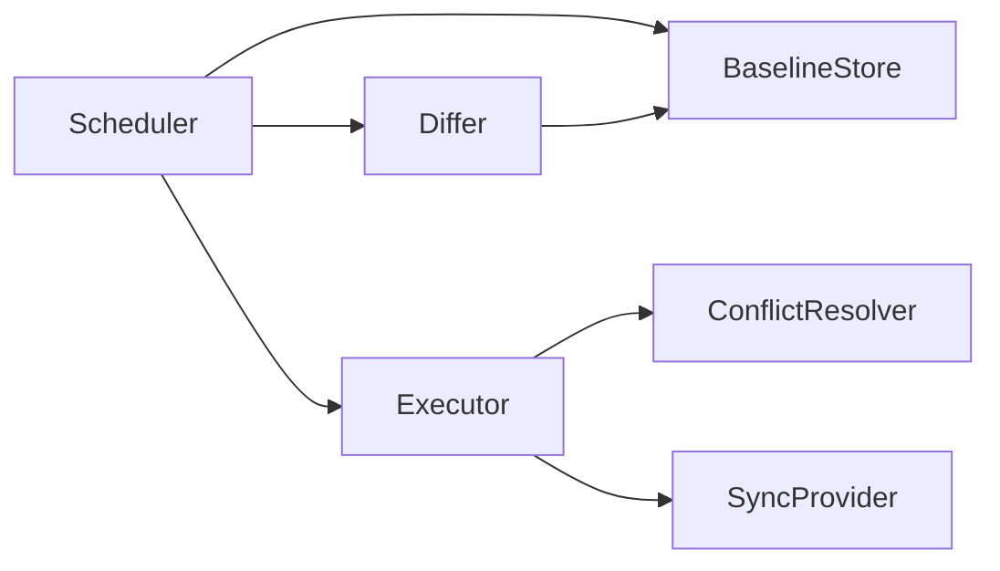

# fs-sync 设计文档

> 文档版本：v0.1（草案）　|　最后更新：2026-07-09

本文档展开实现层面的设计细节，配合《需求文档》《架构说明》《接口文档》阅读。

---

## 1. 本地缓存数据模型

### 1.1 存储视图

本地缓存在两种后端上保持同一逻辑模型：

```
<root>/
  ├── files:       path → { content, meta }
  ├── dirs:        path → { mtime }
  └── meta:        path → FileMeta   （内容与 meta 分离存储，便于仅比对元数据）
```

- **浏览器（IndexedDB）**：建对象仓库 `files`、`dirs`、`meta`、`baseline`、`tombstones`。`files` 存 `Blob`/`ArrayBuffer`，`meta` 存 `FileMeta` 记录。
- **Node.js（磁盘）**：真实目录树存储在 `root` 下；额外维护隐藏元数据目录（如 `.fs-sync/meta.json` 或每张表一个 SQLite/JSON）保存 `FileMeta`、`baseline`、`tombstones`。

> 关键：**元数据与内容分离**，差异检测只走 `meta`，避免大文件全量读取。

### 1.2 `FileMeta` 字段约定

| 字段 | 用途 |
| --- | --- |
| `path` | 归一化 POSIX 路径 |
| `size` | 字节数 |
| `mtime` | 本地修改时间（epoch ms），写时更新 |
| `contentHash` | 内容摘要；用于快速判断内容是否变化 |
| `version` | 本地单调自增版本号，每次 `writeFile`/`rename` 自增 |
| `deleted` | tombstone 标记；`unlink`/`rm` 设 `true` 而非立即物理删除，供同步删除远端 |

### 1.3 哈希与版本策略

- `contentHash` 用稳定摘要（实现可选 `sha1` / 轻量 `xxhash`）；大文件可对分块摘要再聚合，避免一次性读全量。
- `version` 仅本地单调递增，用于"最后写入获胜"的次级判定（mtime 精度不足或时钟回拨时）。

---

## 2. 同步引擎

### 2.1 模块构成



- **Scheduler**：决定何时启动一次同步（manual / interval / 变更触发）。
- **Differ**：基于本地 `meta`、远端 `list()` 结果与 `BaselineStore` 产出差异集。
- **Executor**：按差异集执行 push/pull/remove，处理并发、重试、续传。
- **ConflictResolver**：处理冲突项（见 §3）。
- **BaselineStore**：保存上次成功同步的 `{ local: FileMeta, remote: RemoteMeta }` 映射。

### 2.2 差异检测算法（Differ）

输入：本地全量 `meta`（含 tombstone）、远端 `list()` 全量 `RemoteMeta`、上一次 `baseline`。

对每个路径 `p`，记 `L = localMeta(p)`、`R = remoteMeta(p)`、`B = baseline(p)`：

| 情况 | 判定 | 动作 |
| --- | --- | --- |
| `L` 无，`R` 无 | 无变化 | — |
| `L` 有，`R` 无 | 本地新增 | push |
| `L` 无，`R` 有，`B` 有 | 本地删除 | remove 远端 |
| `L` 无，`R` 有，`B` 无 | 远端新增 | pull |
| `L` 有，`R` 有，`L.hash==R.etag` | 已一致 | — |
| `L` 有，`R` 有，且 `L==B && R==B` | 未变 | — |
| `L` 有，`R` 有，`L!=B` 且 `R==B` | 仅本地改 | push |
| `L` 有，`R` 有，`L==B` 且 `R!=B` | 仅远端改 | pull |
| `L` 有，`R` 有，`L!=B` 且 `R!=B` | 双方改 | **冲突**（见 §3） |

> 删除通过 `L.deleted` 表达：本地 `rm` 不直接物理删，而是标记 `deleted=true`，Differ 据此产生远端 remove；远端 remove 成功后再本地清理 tombstone。

### 2.3 Executor：并发、重试、续传

- **并发**：按 `SyncOptions.concurrency`（默认 4~8）批量执行文件任务；目录与依赖顺序由调用方保证。
- **重试**：单文件失败按指数退避重试 `maxRetries` 次（间隔 `retryBaseMs * 2^attempt`）；超限计入 `errors` 并广播 `error`，不阻断其他文件。
- **幂等**：每个远端操作带幂等键（path + version + contentHash）；重复执行不产生副作用。
- **续传（大文件）**：`push`/`pull` 采用分块（如 4–8 MB）上传/下载；`BaselineStore` 额外记录"已完成块游标"，中断后仅补传剩余块。上传使用支持 `Content-Range` / 分块提交的 Provider 能力（WebDAV `PUT` 续传、GitHub 走完整 blob 则退化为整文件重传）。
- **循环防护**：由同步引擎写入本地的文件（pull 结果）**不打变更标记**，或标记 `source: 'sync'`，避免再次触发 push 回远端形成回声。

### 2.4 基线提交与回滚

- 一次同步**全部成功**后，原子写入 `BaselineStore`：`baseline[p] = { local: 新L, remote: 新R }`。
- 部分失败：成功项可先行更新基线（已达成一致的无需回滚）；仅失败项保留在待同步队列，下次续做。
- 基线写入需为原子操作（IndexedDB 单事务 / Node 原子写临时文件后 rename）。

---

## 3. 冲突检测与解决

### 3.1 冲突定义

当某路径 `p` 满足：`L != B` 且 `R != B`（本地与远端自上次基线后**都被修改**），且 `L` 与 `R` 无法通过"一方等于基线"快进合并时，判定为冲突。

特殊情形：
- 本地修改、远端删除 → 视为冲突（避免误删本地数据），交由 resolver（默认 `lastWriteWins` 以本地 mtime 胜出，保留远端删除前副本）。
- 本地删除、远端修改 → 同样交 resolver。

### 3.2 默认策略 `LastWriteWins`

判定顺序（可配置权重）：

1. 比较 `mtime`：较大者胜；
2. mtime 相近（阈值内，如 ≤ 1s，防时钟抖动）→ 比较 `version`；
3. version 相等 → 比较 `contentHash`（理论上相等则已一致，无需解决）；
4. 仍无法区分 → 退化为保留本地（`keepLocal`）并告警。

落败方处理：默认 `keepLosersCopy=true`，将落败内容另存为 `.<name>.conflict-<side>-<ts>`（如 `a.txt.conflict-remote-1710000000`），便于人工恢复，避免数据丢失。

### 3.3 可插拔接口

`ConflictResolver.resolve(conflict): ConflictResolution`，实现者可：
- 返回 `local` / `remote` 直接采用某侧；
- 返回 `merge` 并提供 `mergedContent`（文本三方合并）；
- 返回 `skip` 触发 `conflict` 事件并挂起，等待 UI 通过 `fs.resolveConflict(path, resolution)` 决策。

### 3.4 三方合并（建议）

`threeWayMerge` 基于 `base`（基线中的内容）：
- 文本：行级 diff（`base` → `local`、`base` → `remote`），自动合并无交叠部分；交叠处标记冲突区段 `<<<<<<<` / `>>>>>>>`，交由用户。
- 二进制：无法逐行合并，退化为 `lastWriteWins` 并保留双方副本。

---

## 4. Provider 扩展机制

### 4.1 接入步骤（第三方）

1. 实现 `SyncProvider` 接口（`authenticate` / `list` / `pull` / `push` / `remove` / `stat`）。
2. 在 `capabilities` 声明是否支持 `versioned` / `etag`，影响冲突判定（缺失则退化为 `mtime`）。
3. 通过 `fs.use(provider)` 挂载；引擎自动将其纳入 `Scheduler` 调度。
4. （可选）发布为独立子包 `fs-sync/<your-target>`，实现 tree-shaking。

### 4.2 内置 Provider 设计要点

| Provider | 读 | 写 | 删 | 元数据来源 |
| --- | --- | --- | --- | --- |
| WebDAV | `GET` | `PUT`（支持 `Content-Range` 续传） | `DELETE` | `PROPFIND` → `getetag`/`getlastmodified` |
| GitHub | Contents API `GET` | Contents API `PUT`（含 commit）或 Git Data API | Contents API `DELETE` | commit SHA 作为 `version` |
| Gitee | 同 GitHub，URL 与鉴权头差异 | 同 | 同 | commit SHA |
| RemoteStorage | `GET`（带 `?`] 列表） | `PUT`（带 `If-Match`） | `DELETE` | `ETag` / `Content-Length` |

> 分页：`list()` 必须支持 `cursor`/`limit`，避免大仓库一次拉取上万条目。

### 4.3 鉴权与凭据

- `authenticate()` 负责建立会话（OAuth token / Basic / App Password）；
- 凭据**不写入本地文件缓存**，仅驻留内存或平台安全存储；
- 鉴权失败抛出 `AuthError`，引擎广播 `error` 且不阻塞本地读写；支持令牌刷新钩子。

---

## 5. 事件与可观测性

- 事件总线解耦引擎与 UI（见 `api.md` §6.1）。
- 同步过程不阻塞主流程；进度通过 `progress` 流式上报。
- 可注入 `Logger` 输出诊断信息；`status()` 提供当前状态快照与待同步队列长度。

---

## 6. 性能与健壮性设计

| 主题 | 设计 |
| --- | --- |
| 大目录 | `list`/`walk` 分页与游标；`readdir` 不一次性物化全部内容 |
| 大文件 | 流式 + 分块；`contentHash` 分块聚合；续传游标 |
| 内存 | 同步任务队列上限；内容仅在需要 push/pull 时加载，不常驻 |
| 失败恢复 | 指数退避、部分成功基线提交、待同步队列留存 |
| 防回声 | 同步写本地标记 `source:'sync'`，不参与变更触发 |
| 配额 | 浏览器配额预警 + LRU 淘汰（建议实现） |

---

## 7. 测试策略（建议）

| 层级 | 内容 | 工具 |
| --- | --- | --- |
| 单元 | Differ 差异矩阵、ConflictResolver 各策略、哈希/版本逻辑 | Vitest |
| 集成 | 引擎 + 内存版 `StorageAdapter` + Mock `SyncProvider` 跑完整双向同步 | Vitest |
| 适配器 | 真实 WebDAV/GitHub 等在 CI 用测试仓库验证（可标记 slow） | Vitest + 容器/测试账号 |
| 跨端 | 浏览器（Playwright）+ Node 双端行为一致性 | Playwright |

> 核心逻辑需"可脱离网络单测"：用内存 `StorageAdapter` 与 Mock Provider 即可验证同步与冲突算法。

---

## 8. 构建与发布（建议）

- TypeScript strict；输出 ESM + CJS + `.d.ts`（tsup / Rollup）。
- 包切分：`fs-sync`（核心）+ `fs-sync/webdav`、`fs-sync/github`、`fs-sync/gitee`、`fs-sync/remote-storage`（按需）。
- 浏览器入口仅含核心，Provider 按需引入以控制体积。
